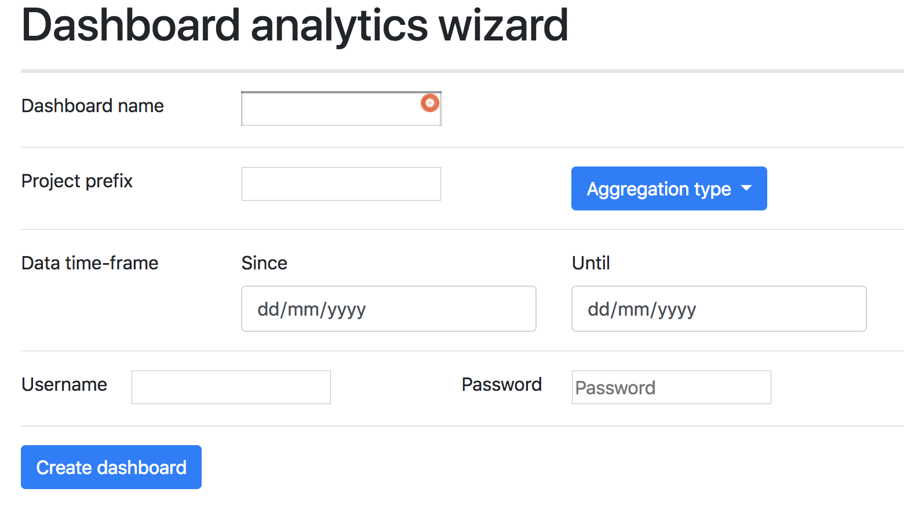
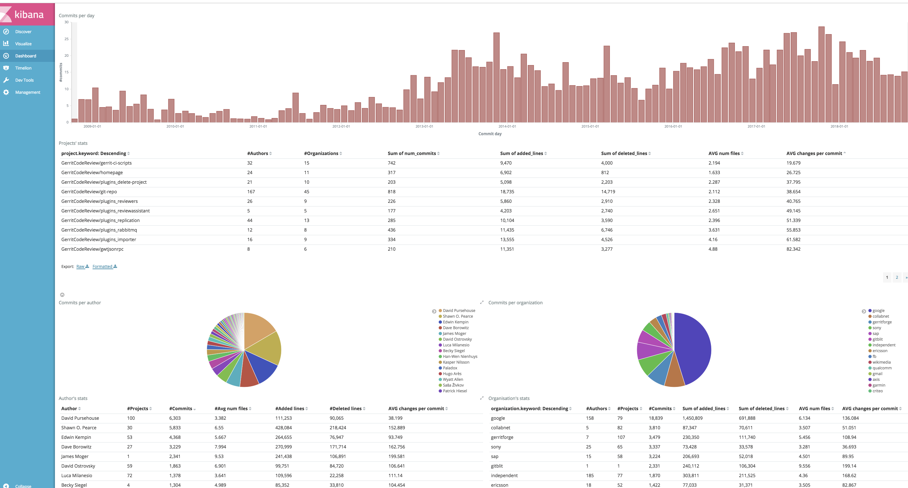
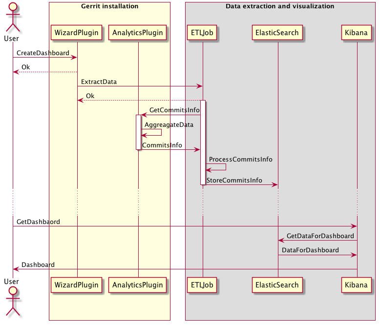

# Analytics Wizard plugin

Wizard to locally setup an Analytics Dashboard like the [Gerrit's one](https://gerrit-analytics.gerritforge.com).
This will allow you to explore the potentials of **DevOps Analytics** on your own repositories.

## What it DOES
* Setup a ready to use Analytics Dashboard with some defaults charts
* Populate the Dashboard with data coming from the repos you would like to analyse

## What it DOES NOT
* Schedule recurring import of the data, but just the first one
* Create a production ready environment. It is meant to build a *playground* to explore the potential of **DevOps
analytics**
* Create multiple dashboards

# Setup

## Prerequisites
* Gerrit v2.16
* [Analytics plugin](https://gerrit.googlesource.com/plugins/analytics/)

##Installation

Copy the [latest available jar](https://gerrit-ci.gerritforge.com/job/plugin-analytics-wizard-sbt-master-master/) into the Gerrit plugins directory and restart it.
Assuming `/usr/local/gerrit ` is the location of your Gerrit installation simply execute the following:

```bash
curl -o /tmp/analytics-wizard.jar https://gerrit-ci.gerritforge.com/job/plugin-analytics-wizard-sbt-master-master/analytics-wizard.jar &&\
cp /tmp/analytics-wizard.jar /usr/local/gerrit/plugins
```

# How to use it
Once the plugin is installed and you are logged in Gerrit browse to this url: [https://<you_gerrit_url>/plugins/analytics-wizard/static/analytics-dashboard.html]()

You will land on this screen:



Different parameters can be configured:
* **Dashboard name** (required): name of the dashboard you are about to create
* **Projects prefix** (optional): prefix of the projects you want to import, i.e.: to import all the projects under the Gerrit namespace, you can specify `gerrit/`. *Note: It is not a regular expression.*
* **Aggregation type** (required): the data can be aggregated by `email only`, by `email per hour`, by `email per day`, by `email per month` or by `email per year`.
* **Date time-frame** (optional): time window you want to collect data about
* **Username/Password** (optional): credentials for Gerrit API, if basic auth is needed

Once you set the parameters pressing the "Create Dashboard" button will trigger the Dashboard creation and the data import.

*Beware this operation will take a while since it requires to download several Docker images and run an ETL job to collect and aggregate the data.*

At the end of this operation you will be presented with a dashbaord similar to this one:



You can now navigate among the different charts and uncover the potentials of DevOps analytics!

# Components interaction



# Development

* [Project Git repo](https://gerrit.googlesource.com/plugins/analytics-wizard/)
* The project relies on:
  * an [ETL data extractor](https://gerrit.googlesource.com/apps/analytics-etl)
  * an [Analytics plugin](https://gerrit.googlesource.com/plugins/analytics/) to expose Gerrit metrics
* [CI/CD](https://gerrit-ci.gerritforge.com/job/plugin-analytics-wizard-sbt-master-master/)

To build the plugin, [JDK 1.8](https://www.oracle.com/technetwork/java/javase/downloads/jdk8-downloads-2133151.html) and [sbt](https://www.scala-sbt.org/) are required.
Once installed use *sbt* to build:
```bash
cd ./analytics-wizard
sbt assembly
```

This will compile, test and package the plugin artifact, which can be found in `./target/scala-2.11/analytics-wizard.jar`.


